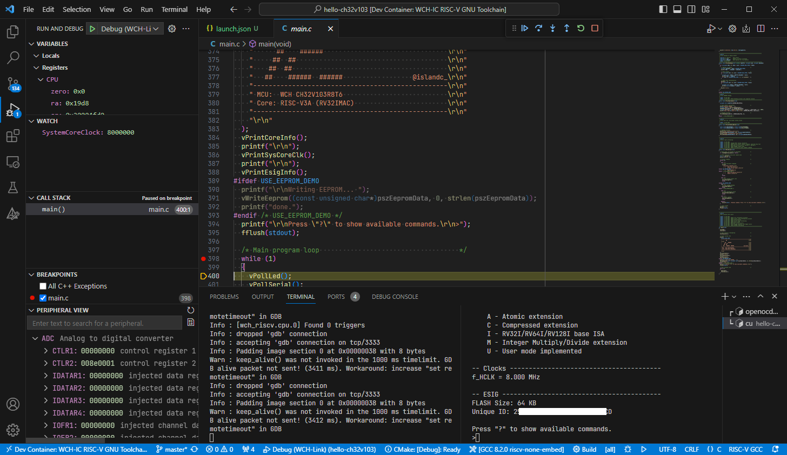

# wch-riscv-devcontainer
   

*WCH-IC RISC-V development and debugging environment inside a VSCode devcontainer.*

### Packages
* [Microsoft .NET 6.0 Runtime](https://dotnet.microsoft.com/en-us/download/dotnet/6.0) Version 6.0.24
* [MounRiver MRS Toolchain & Debugger](http://www.mounriver.com/download) Linux_x64 Version 1.80
  * includes WCH-custom GNU toolchain for RISC-V
  * includes WCH-custom OpenOCD debugger
* [CMake](https://cmake.org/download) Version 3.27.7

## System Requirements
* VSCode [Dev Containers](https://marketplace.visualstudio.com/items?itemName=ms-vscode-remote.remote-containers) extension
* (WSL only) [usbipd-win](https://learn.microsoft.com/en-us/windows/wsl/connect-usb) (Windows *and* WSL parts installed!)

## Usage
* Include this repo as `.devcontainer` in the root of your project
* Connect debug probe 
  * (WSL only) attach to WSL from within Windows: `usbipd wsl attach --busid <...> -a`
* Select `Dev Containers: Reopen in Container`

For CMake projects:
* Upon prompt, select the `GCC x.x riscv-none-embed` CMake Kit. 
  * Alternatively, a toolchain definition file is provided in: `$CMAKE_CONFIGS_PATH/gcc-riscv-none-embed.cmake`.
* Run `CMake: Configure`
* Build using `CMake: Build [F7]`

### CMake+IntelliSense Notes
Upon first run, an error message may appear in Line 1, Column 1. Try re-running CMake configuration, or run a build.

### WCH-Link Notes
You may need to install the WCH-provided udev rules files in order to access the debug probes without root privileges. See `/tmp/MRS/beforeinstall/` inside the container.

**Note:** the rules file needs to be installed on the **host**!

### OpenOCD Config File
Configuration files for the OpenOCD debugger are included in `/opt/openocd/bin/`. To start the debugger, run the following command inside the devcontainer terminal:

    openocd -f /opt/openocd/bin/wch-riscv.cfg

### Peripheral Description Files Notes
Peripheral description files (SVD) for RISC-V MCUs are provided in `/opt/wch/`.

### Serial Monitor
To access the WCH-Link serial monitor inside the devcontainer, use the `cu` command as shown below:

    cu -l <serial port device> -s <baudrate>

e.g. "`cu -l /dev/ttyACM0 -s 115200`".

To close the connection, press RETURN/ESC/Ctrl-C, type "`~.`" (tilde, dot) and wait for 3 seconds.

## Licensing

If not stated otherwise, the contents of this project are licensed under The MIT License. The full license text is provided in the [`LICENSE`](LICENSE) file.

    SPDX-License-Identifier: MIT